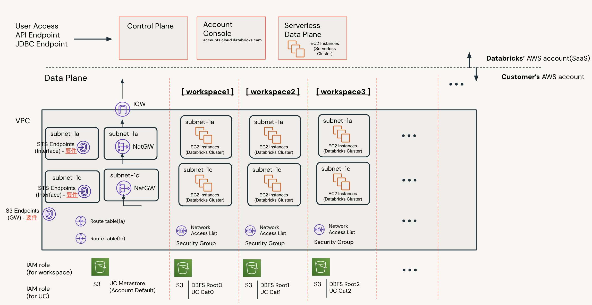

# env

directory for main terraform files for each envs

## Multiple workpsace in single VPC

In this scenario, single VPC deploment comes first, followed by each workspace deployment. The `env/single_vpc_multi_workspace_deployment/shared_resouece` covers VPC deployment, while `env/single_vpc_multi_workspace_deployment/workspace[0123]` takes workspace deployment on the VPC.

Each workspace has a subnet per az and az spans two zones, so two subnets per workspace will be created. Clusers in the workspace stays these subnets.



### 1. clone this repo
```
$ git clone https://github.com/ktmrmshk/terradbx.git
$ cd terradbx
$ ls
README.md	env		modules

$ cd env/single_vpc_multi_workspace_deployment
$ ls 
README.md  shared_resoruce_deployment  workspace_deployment
```

### 2. set env variables

Two account infos and its credentials are needed:

* Databricks E2 account
* AWS account

Set the these params as env variables for security.

```
### Databricks
$ export TF_VAR_databricks_account_username='admin@your.company.com'
$ export TF_VAR_databricks_account_password='1234567890asdfghjk'
$ export TF_VAR_databricks_account_id='11111111-222222-33333-44444-5555555'

### AWS
$ export AWS_ACCESS_KEY_ID="ABC123EFG987"
$ export AWS_SECRET_ACCESS_KEY="xxxxxxxxxxxxxxxxxxxx"
```


### 3. deploy shared_resources (mainly VPC)

```
$ cd shared_resoruce_deployment
$ cp terraform.tfvars.example terraform.tfvars
$ vim terraform.tfvars

----
prefix = "your_project_name"

aws_region     = "us-west-2"
aws_account_id = "123123abcavc"

vpc_cidr                        = "10.99.0.0/16"
private_subnets_for_endpoints   = ["10.99.254.0/24", "10.99.253.0/24"]
public_subnets_for_natgw_per_az = ["10.99.252.0/24", "10.99.251.0/24"]

tag_environment = "Stag/Dev"
tag_owner       = "your_name"
tag_budget      = "marketing"
----

(edit properly!)
```

Then, run the terraform apply

```
$ terraform init
$ terraform apply
```

The output params are needed next step.

### 4. workspace deployment

```
$ cd ../workspace_deployment
$ cp terraform.tfvars.example terraform.tfvars
$ vim terraform.tfvars

prefix                          = "your_project_workspace1"
aws_region                      = "ap-northeast-1"
aws_account_id                  = "123456789"

// edit according to the output from "share_resouece" tarraform run results
vpc_id = "vpc-0b02244784459c387"
cidrs  = ["10.99.200.0/24", "10.99.201.0/24"]
azs = [
  "ap-northeast-1a",
  "ap-northeast-1c",
]
route_tables = [
  "rtb-0233e1bb7deb43be6",
  "rtb-01ad2dd24d1402225",
]
security_group = "sg-0cbd631878b4fc9c1"

credentials_id = "ed3daad2-656c-4d88-a60f-e3bfff0b25a7"

uc_default_metastore_id = "6f7cb75c-53ec-4316-a1f7-267c5f0f96dc"
aws_role_uc_access_arn  = "arn:aws:iam::12345553422:role/your-project-vpc-cred-uc-access"

(edit properly! Some of params are inherited from "shared_resource" results)
```

Then, run the terraform apply

```
$ terraform init
$ terraform apply
```
